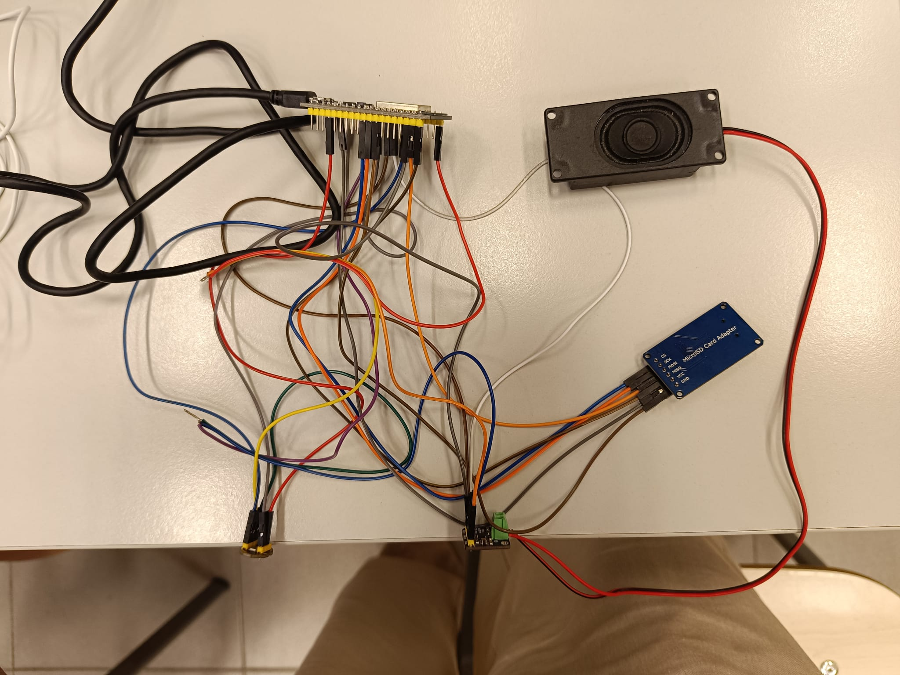

# Proyecto PD - GRABADORA Y REPRODUCTOR DE AUDIO

## Introducción y funcionamiento 
Este proyecto tiene como objetivo principal permitir grabar audio utilizando un micrófono, guardarlo en una tarjeta SD en formato WAV y luego reproducir el audio grabado a través de un altavoz. Además, proporciona una interfaz web simple para controlar estas funciones.

#### Materiales:
- ESP32
- Tarjeta SD
- Microfono
- Altavoz 
- MAX98357A 


### Código y explicación 
```c++

#include <Arduino.h>
#include "Audio.h"
#include <SD.h>
#include <SPI.h>
#include <driver/i2s.h>
#include "AudioFileSourceSD.h"
#include "AudioOutputI2S.h"
#include "AudioGeneratorWAV.h"
#include <WiFi.h>
#include <WebServer.h>

void setupI2S_RX();
void setupI2S();
void setupSD();
void writeWavHeader(File file, int sampleRate, int bitsPerSample, int channels, int dataSize);
void recordAudioToFile(const char* filename, int duration);
void reproducirAudio(); 
void handleRecord();
void handlePlay();
void handleStop();

// Configuración del I2S para micrófono
#define I2S_WS 15
#define I2S_SCK 14
#define I2S_SD 32

// Configuración del I2S para altavoz
#define I2S_BCLK 26
#define I2S_LRC 25
#define I2S_DOUT 22

// Configuración de la tarjeta SD
#define SD_CS 5

// Configuración del archivo de audio
#define FILE_NAME "/audio.WAV"
#define SAMPLE_RATE 16000
#define BITS_PER_SAMPLE I2S_BITS_PER_SAMPLE_16BIT
#define CHANNEL_FORMAT I2S_CHANNEL_FMT_ONLY_LEFT
#define BUFFER_SIZE 1024

const char* ssid = "AndroidAP8342";
const char* password = "12345678";

WebServer server(80);

AudioGeneratorWAV *wav;
AudioFileSourceSD *file;
AudioOutputI2S *out;

void setup() {
  // Iniciar la comunicación serie
  Serial.begin(115200);

  // Configurar WiFi
  WiFi.begin(ssid, password);
  while (WiFi.status() != WL_CONNECTED) {
    delay(1000);
    Serial.println("Conectando a WiFi...");
  }
  Serial.println("Conectado a WiFi");

  Serial.println(WiFi.localIP());

  // Configurar servidor web
  server.on("/", []() {
    server.send(200, "text/html", R"(
      <html lang="es">
<head>
  <meta charset="UTF-8">
  <meta name="viewport" content="width=device-width, initial-scale=1.0">
  <title>Control de Audio</title>
  <style>
    body {
      font-family: Arial, sans-serif;
      background-color: #f2f2f2;
      text-align: center;
      margin: 50px;
    }
    .button-container {
      display: flex;
      justify-content: center;
      gap: 20px;
      margin-top: 20px;
    }
    .button {
      padding: 10px 20px;
      font-size: 16px;
      border: none;
      border-radius: 5px;
      cursor: pointer;
      transition: background-color 0.3s ease;
    }
    .button:hover {
      background-color: #4CAF50; /* Color verde cuando se pasa el mouse sobre el botón */
      color: white;
    }
    .button.record {
      background-color: #f44336; /* Color rojo para el botón de grabar */
    }
    .button.play {
      background-color: #2196F3; /* Color azul para el botón de reproducir */
    }
    .button.stop {
      background-color: #FFC107; /* Color amarillo para el botón de detener */
    }
  </style>
</head>
<body>
  <h1>Control de Audio</h1>
  <div class="button-container">
    <button class="button record" onclick="location.href='/record'">Grabar</button>
    <button class="button play" onclick="location.href='/play'">Reproducir</button>
    <button class="button stop" onclick="location.href='/stop'">Detener</button>
  </div>
</body>
</html>
    )");
  });
 

  server.on("/record", handleRecord);
  server.on("/play", handlePlay);
  server.on("/stop", handleStop);

  server.begin();

  // Configurar I2S para micrófono (RX)
  setupI2S_RX();

  // Configurar SD
  setupSD();
}

void setupI2S_RX() {
  // Configurar el pinout del I2S
  i2s_config_t i2s_config = {
    .mode = (i2s_mode_t)(I2S_MODE_MASTER | I2S_MODE_RX),
    .sample_rate = SAMPLE_RATE,
    .bits_per_sample = BITS_PER_SAMPLE,
    .channel_format = CHANNEL_FORMAT,
    .communication_format = I2S_COMM_FORMAT_I2S_MSB,
    .intr_alloc_flags = ESP_INTR_FLAG_LEVEL1,
    .dma_buf_count = 4,
    .dma_buf_len = BUFFER_SIZE,
    .use_apll = false,
    .tx_desc_auto_clear = false,
    .fixed_mclk = 0
  };

  i2s_pin_config_t pin_config = {
    .bck_io_num = I2S_SCK,
    .ws_io_num = I2S_WS,
    .data_out_num = I2S_PIN_NO_CHANGE,
    .data_in_num = I2S_SD
  };

  // Inicializar el I2S
  i2s_driver_install(I2S_NUM_0, &i2s_config, 0, NULL);
  i2s_set_pin(I2S_NUM_0, &pin_config);
  i2s_zero_dma_buffer(I2S_NUM_0);
}

void setupSD() {
  // Inicializar la tarjeta SD
  if (!SD.begin(SD_CS)) {
    Serial.println("Error al montar la tarjeta SD");
    while (true);
  }
}

void writeWavHeader(File file, int sampleRate, int bitsPerSample, int channels, int dataSize) {
  byte header[44];
  
  // Chunk ID "RIFF"
  header[0] = 'R'; header[1] = 'I'; header[2] = 'F'; header[3] = 'F';
  
  // Chunk size
  int chunkSize = dataSize + 36;
  header[4] = (byte)(chunkSize & 0xFF);
  header[5] = (byte)((chunkSize >> 8) & 0xFF);
  header[6] = (byte)((chunkSize >> 16) & 0xFF);
  header[7] = (byte)((chunkSize >> 24) & 0xFF);
  
  // Format "WAVE"
  header[8] = 'W'; header[9] = 'A'; header[10] = 'V'; header[11] = 'E';
  
  // Subchunk1 ID "fmt "
  header[12] = 'f'; header[13] = 'm'; header[14] = 't'; header[15] = ' ';
  
  // Subchunk1 size (16 for PCM)
  header[16] = 16; header[17] = 0; header[18] = 0; header[19] = 0;
  
  // Audio format (1 for PCM)
  header[20] = 1; header[21] = 0;
  
  // Number of channels
  header[22] = channels; header[23] = 0;
  
  // Sample rate
  header[24] = (byte)(sampleRate & 0xFF);
  header[25] = (byte)((sampleRate >> 8) & 0xFF);
  header[26] = (byte)((sampleRate >> 16) & 0xFF);
  header[27] = (byte)((sampleRate >> 24) & 0xFF);
  
  // Byte rate
  int byteRate = sampleRate * channels * bitsPerSample / 8;
  header[28] = (byte)(byteRate & 0xFF);
  header[29] = (byte)((byteRate >> 8) & 0xFF);
  header[30] = (byte)((byteRate >> 16) & 0xFF);
  header[31] = (byte)((byteRate >> 24) & 0xFF);
  
  // Block align
  int blockAlign = channels * bitsPerSample / 8;
  header[32] = (byte)(blockAlign & 0xFF);
  header[33] = (byte)((blockAlign >> 8) & 0xFF);
  
  // Bits per sample
  header[34] = bitsPerSample; header[35] = 0;
  
  // Subchunk2 ID "data"
  header[36] = 'd'; header[37] = 'a'; header[38] = 't'; header[39] = 'a';
  
  // Subchunk2 size
  header[40] = (byte)(dataSize & 0xFF);
  header[41] = (byte)((dataSize >> 8) & 0xFF);
  header[42] = (byte)((dataSize >> 16) & 0xFF);
  header[43] = (byte)((dataSize >> 24) & 0xFF);
  
  // Write the header to the file
  file.write(header, 44);
}

void recordAudioToFile(const char* filename, int duration) {
  // Abrir el archivo para escribir
  File file = SD.open(filename, FILE_WRITE);
  if (!file) {
    Serial.println("Error al abrir el archivo para escribir");
    return;
  }

  // Escribir el encabezado WAV (con un tamaño de datos de 0 inicialmente)
  writeWavHeader(file, SAMPLE_RATE, 16, 1, 0);

  // Capturar y guardar audio
  int64_t endTime = millis() + duration;
  size_t bytesRead;
  uint8_t buffer[BUFFER_SIZE];
  int totalBytesWritten = 0;

  while (millis() < endTime) {
    i2s_read(I2S_NUM_0, buffer, BUFFER_SIZE, &bytesRead, portMAX_DELAY);
    file.write(buffer, bytesRead);
    totalBytesWritten += bytesRead;
  }

  // Actualizar el encabezado WAV con el tamaño correcto de datos
  file.seek(0);
  writeWavHeader(file, SAMPLE_RATE, 16, 1, totalBytesWritten);

  // Cerrar el archivo
  file.close();
}

void setupI2S() {
  // Inicializar el I2S para salida de audio
  out = new AudioOutputI2S();
  out->SetPinout(I2S_BCLK, I2S_LRC, I2S_DOUT);
  //out->SetGain(1.0); 
}

void reproducirAudio() {
  // Abrir el archivo de audio
  file = new AudioFileSourceSD(FILE_NAME);
  wav = new AudioGeneratorWAV();

  if (!wav->begin(file, out)) {
    Serial.println("Error al abrir el archivo de audio");
    while (1);
  } else {
    Serial.println("Reproduciendo audio...");

  }
}

void handleRecord() {
  // Configurar I2S para micrófono (RX)
  setupI2S_RX();
  
  // Grabar audio por 10 segundos y guardarlo en un archivo
  recordAudioToFile(FILE_NAME, 10000);
  Serial.println("Grabación completada y guardada en la tarjeta SD");

  // Detener I2S
  i2s_driver_uninstall(I2S_NUM_0);

  server.send(200, "text/plain", "Grabacion completada");
}

void handlePlay() {
  // Configurar I2S para altavoz (TX)
  setupI2S();
  
  // Reproducir el audio grabado
  reproducirAudio();
  
  server.send(200, "text/plain", "Reproduciendo audio...");
}

bool isPlaying = false;

void handleStop() {
  if (wav && wav->isRunning()) {
    wav->stop();
    isPlaying = false;
  }
  server.send(200, "text/plain", "Reproduccion detenida");
}


void loop() {
  server.handleClient();
  
  // Verificar si la reproducción está en curso
  if (wav && wav->isRunning()) {
    wav->loop();
  } else if (wav) {
    // Si la reproducción ha finalizado
    Serial.println("Reproduccion completada");
    file->close();
    delete wav;
    delete file;
    wav = nullptr;
    file = nullptr;
    isPlaying = false;
  }
}

```
Este programa configura un ESP32 para capturar audio de un micrófono, guardarlo en una tarjeta SD y reproducirlo a través de un altavoz, todo controlado mediante una interfaz web. Utiliza buses de comunicación I2S para el audio y SPI para la tarjeta SD, junto con WiFi para la interfaz web.

Se incluyen librerías necesarias para trabajar con audio (Audio.h, AudioFileSourceSD.h, AudioOutputI2S.h, AudioGeneratorWAV.h), la tarjeta SD (SD.h), y WiFi (WiFi.h).

Se declaran las funciones que serán definidas más adelante: setupI2S_RX, setupI2S, setupSD, writeWavHeader, recordAudioToFile, reproducirAudio, handleRecord, handlePlay, handleStop.

#### Definición de pines:
Pines para el I2S (Inter-IC Sound) del micrófono y altavoz.
Pin para el chip select de la tarjeta SD.

#### Configuración de la red WiFi:
Se configuran las credenciales de la red WiFi y se inicia la conexión.

#### Configuración del servidor web:
Se configura un servidor web simple que responde a diferentes rutas ("/", "/record", "/play", "/stop") con diferentes funciones.

#### Configuración del I2S para micrófono (RX):
Se configura el I2S en modo recepción para capturar audio desde el micrófono.

#### Inicialización de la tarjeta SD:
Se monta la tarjeta SD para permitir la lectura y escritura de archivos.

#### Grabación de audio en un archivo:
- recordAudioToFile: Captura audio desde el micrófono y lo guarda en la tarjeta SD en formato WAV.
  
#### Configuración del I2S para altavoz (TX):
- setupI2S: Configura el I2S en modo transmisión para enviar audio al altavoz.

#### Reproducción de audio:
 - reproducirAudio: Abre el archivo de audio desde la tarjeta SD y comienza la reproducción a través del altavoz.
   
#### Manejadores de rutas del servidor web:

- handleRecord: Llama a la función de grabación de audio.
- handlePlay: Llama a la función de reproducción de audio.
- handleStop: Detiene la reproducción de audio.

#### Bucle principal:
- loop: Maneja las peticiones del servidor web y verifica si la reproducción de audio está en curso.

#### Imagen del montaje:



## Conclusión
El código configura un dispositivo Arduino para actuar como un grabador y reproductor de audio controlado vía WiFi. Utiliza el protocolo I2S para la comunicación con el micrófono y el altavoz, la tarjeta SD para el almacenamiento de los archivos de audio, y un servidor web para la interfaz de usuario. La grabación y reproducción de audio se gestionan mediante archivos WAV almacenados en la tarjeta SD.


